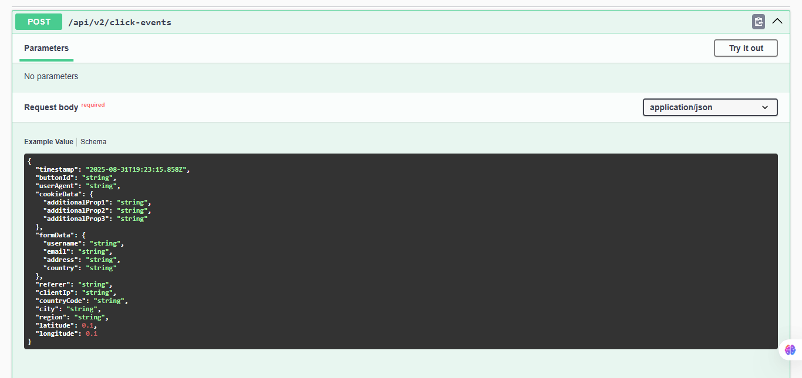

## _Pipelining Data from a Web Page_ <br />
When dealing with events, in order to get my hands dirty and understand how to build an application that collect analytics 
data from a web page, where each button clicked or an input field has been filled in or a mouse move has been done, to 
generates an event and this event be consumed by an API that has a Kafka broker attached and persisting these data to a 
AWS S3-like object storage, partitioned by hour through a Spark processing and having this data available through Hive SQL 
tables. 
<br />
A front-end application was built <a href="https:github.com/rnhc1000/pipeline-ui" target="_blank">pipeline-ui</a> in order 
to generate the events to emulate a user surfing in a web page and collecting some data. Hopefully this
codebase can help someone to better understand how a pipeline is built under the hood.

## _Table of contents_

- [_Overview_](#overview)
- [_Requirements_](#requirements)
- [_Project Structure_](#requirements)
- [_Howto Build and Run_](#requirements)
- [_Screenshot_](#screenshot)
- [_Links_](...)
- [_Built with_](#built-with)
- [_Code Snippet_](#requirements)
- [_Continued development_](#continued-development)
- [_Useful resources_](#useful-resources)
- [_Author_](#requirements)
- [_Portfolio_](#requirements)

## _Overview_

<br />

## _Requirements_
There are some specific requirements to be met, such as authentication and authorization, data persistence, 
paginated data recovery, authenticated access to endpoints and some other requirements.<br />
<br />
The app has been coded using ReactJS, TypeScript, Java 21, Spring Boot 3.3.5, Gradle, Javadoc, Spring Security, Spring JPA,
Spark, Kafka, Minio,  OpenAPI, PostgresSQL, Docker and hosted in an AWS EC2 instance with secure access provided
by a NGINX SSL proxy reverse and being live at <a href="https://pipeline.ferreiras.dev.br" target="_blank">Pipeline</a> <br />
<br />

<hr />

## _Project Structure_
- docs
   - javadocs
- src
    - main
    - java
        - br.dev.ferreiras.PipelineApiApplication
            - config
            - controller
              - handlers 
            - dto
            - entity
            - enums
            - mapper
            - repository
            - services
              - exceptions
    - resources
        - db.migration
        - certs
    - test
-

## _Howto Build and Run_

  ```

  """

  ...

   ....
  """
  


```

## _Screenshot_

[]()

## _Links_

- Live Site URL: <a href="https://pipeline.ferreiras.dev.br" target="_blank">Pipeline</a>

## _Built with_

[](https://skillicons.dev)

## _Code Snippet_

```java
/**
 *
 * @author ricardo@ferreiras.dev.br
 * @version 1.1.030901
 * @since 1.0
 *
 */
package br.dev.ferreiras.pipeline_api.config;

import org.apache.kafka.clients.producer.ProducerConfig;
import org.apache.kafka.common.serialization.StringSerializer;
import org.springframework.context.annotation.*;
import org.springframework.kafka.core.*;
import org.springframework.kafka.support.serializer.JsonSerializer;
import java.util.HashMap;
import java.util.Map;


@Configuration
public class KafkaProducerConfig {

    @Bean
    public ProducerFactory<String, Object> producerFactory() {
        Map<String, Object> configProps = new HashMap<>();

        configProps.put(ProducerConfig.BOOTSTRAP_SERVERS_CONFIG, "172.31.40.1:9092");
        configProps.put(ProducerConfig.KEY_SERIALIZER_CLASS_CONFIG, StringSerializer.class);
        configProps.put(ProducerConfig.VALUE_SERIALIZER_CLASS_CONFIG, JsonSerializer.class);
        configProps.put(ProducerConfig.ACKS_CONFIG, "all");
        configProps.put(ProducerConfig.RETRIES_CONFIG, 3);

        return new DefaultKafkaProducerFactory<>(configProps);
    }

    @Bean
    public KafkaTemplate<String, Object> kafkaTemplate() {
        return new KafkaTemplate<>(producerFactory());
    }
}
 ``` 
Outcome...
``` json
{
        "topic": "click-events",
        "partition": 0,
        "offset": 29,
        "timestamp": 1749676029658,
        "key": null,
        "value": {
        "countryCode": "BR",
        "userAgent": "Mozilla/5.0 (Windows NT 10.0; Win64; x64) AppleWebKit/537.36 (KHTML, like Gecko) Chrome/137.0.0.0 Safari/537.36",
        "formData": {
        "username": "guacadmin",
        "email": "rnhc1000@gmail.com",
        "address": "Rua Lisboa, 757",
        "country": "BR"
        },
        "city": "New City",
        "longitude": 49.4762,
        "timestamp": "2025-06-11T21:07:09.392Z",
        "latitude": 6.5238,
        "referer": "http://192.168.0.18:8000/pages",
        "region": "MA",
        "clientIp": "192.168.0.16",
        "buttonId": "loginButton",
        "cookieData": {
        "user-id": "5bff99ec-4b5a-474d-818c-41a33874c89f",
        "session-id": "",
        "source": "landing-page"
        }
        },
        "headers": "{}"
        }
``` 

## _Continued development_

- Unit Tests - TBD
- Subscriber Authentication - TBD
- Spring JWT-OAuth2 - TBD
- Records Pagination - TBD

### _Useful resources_

- [https://spring.io] Awesome Java framework!.
- [https://start.spring.io/]  Handy startup tool.
- [https://mvnrepository.com] Tools that help tackle the beast

## _Author_
<a href="mailto:ricardo@ferreiras.dev.br">Ricardo Ferreira</a>

## - _Portfolio_
<a href="https://www.ferreiras.dev.br" target="_blank">My Portfolio...</a>

